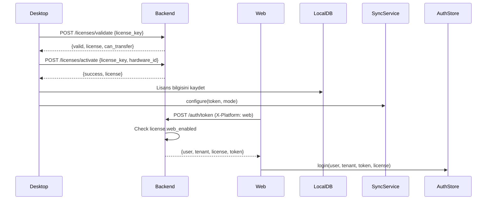

# 🔄 BADER Lisans ve Senkronizasyon Sistemi

## Genel Bakış

Bu sistem, Desktop ve Web platformları arasında lisans kontrolü ve veri senkronizasyonu sağlar.

---

## 📋 Lisans Modları

| Mod | Desktop | Web | Mobil | Sync |
|-----|---------|-----|-------|------|
| **LOCAL** | ✅ | ❌ | ❌ | ❌ |
| **ONLINE** | ❌ | ✅ | ✅ | ✅ |
| **HYBRID** | ✅ | ✅ | ✅ | ✅ |

---

## 🔐 Lisans Akışı



---

## 🔄 Senkronizasyon Akışı

### Desktop → Backend (Push)
```typescript
// Her CRUD işleminde:
await syncService.queueChange(tenantId, 'uyeler', 'create', data);

// SyncService otomatik olarak:
// 1. Local DB'ye sync_changes tablosuna kaydet
// 2. Eğer HYBRID mode ve online ise backend'e POST et
```

### Backend → Desktop (Pull)
```typescript
// App.tsx'de otomatik (her 2 dakika):
await syncService.pullFromServer(tenantId);

// SyncService:
// 1. GET /sync/pull/{tenant_id}
// 2. Her tablo için upsert_xxx_from_sync invoke et
```

---

## 📡 API Endpoint'leri

### Lisans
| Endpoint | Method | Açıklama |
|----------|--------|----------|
| `/api/v1/licenses/validate` | POST | Lisans doğrula |
| `/api/v1/licenses/activate` | POST | Lisans aktive et |
| `/api/v1/licenses/transfer` | POST | Lisans transfer et |
| `/api/v1/licenses/my-license` | GET | Aktif lisans bilgisi |

### Auth
| Endpoint | Method | Header | Açıklama |
|----------|--------|--------|----------|
| `/api/v1/auth/token` | POST | X-Platform | Login |
| `/api/v1/auth/me` | GET | Authorization | User bilgisi |

### Sync
| Endpoint | Method | Açıklama |
|----------|--------|----------|
| `/api/v1/sync/push` | POST | Toplu push |
| `/api/v1/sync/pull/{tenant_id}` | GET | Toplu pull |
| `/api/v1/sync/uye` | POST | Tek üye sync |
| `/api/v1/sync/gelir` | POST | Tek gelir sync |
| `/api/v1/sync/gider` | POST | Tek gider sync |
| `/api/v1/sync/kasa` | POST | Tek kasa sync |

---

## 🧩 Platform Davranışları

### Desktop (LOCAL Mode)
- Tüm veri yerel SQLite'ta
- Sync devre dışı
- Sadece desktop erişimi

### Desktop (HYBRID Mode)
- Veri yerel SQLite + Backend sync
- Her CRUD işlemi backend'e push edilir
- Her 2 dakikada backend'den pull yapılır
- Desktop + Web + Mobil erişimi

### Web (ONLINE/HYBRID Mode)
- Veri backend PostgreSQL'de
- Real-time CRUD işlemleri
- Lisans kontrolü login sırasında
- web_enabled kontrolü

---

## 🔧 Konfigürasyon

### Desktop authStore.ts
```typescript
// Login sırasında sync konfigürasyonu:
const licenseMode = license?.type?.toLowerCase();
syncService.configure(token, licenseMode);
```

### Desktop App.tsx
```typescript
// Otomatik sync (HYBRID mode):
useEffect(() => {
  if (licenseMode === 'HYBRID') {
    syncService.pullFromServer(tenantId);
    setInterval(() => syncService.pullFromServer(tenantId), 2 * 60 * 1000);
  }
}, [isAuthenticated]);
```

### Web login.tsx
```typescript
// Login request:
fetch('/auth/token', {
  headers: { 'X-Platform': 'web' }
});

// Response ile:
login(user, tenant, token, license);
```

---

## 📊 Veri Tabloları

| Tablo | Desktop | Backend | Sync |
|-------|---------|---------|------|
| users | ✅ | ✅ | - |
| tenants | ✅ | ✅ | - |
| licenses | ✅ | ✅ | - |
| uyeler | ✅ | ✅ | ✅ |
| gelirler | ✅ | ✅ | ✅ |
| giderler | ✅ | ✅ | ✅ |
| kasalar | ✅ | ✅ | ✅ |
| aidatlar | ✅ | ✅ | ✅ |

---

## ✅ Çalışan Özellikler

- [x] Lisans doğrulama
- [x] Lisans aktivasyonu (hardware_id ile)
- [x] Lisans transferi
- [x] Platform erişim kontrolü (web_enabled, desktop_enabled)
- [x] Desktop → Backend push (HYBRID)
- [x] Backend → Desktop pull (HYBRID)
- [x] Otomatik sync (2 dakika interval)
- [x] Offline queue (sync_changes tablosu)
- [x] Web login ile lisans bilgisi

---

## 🚧 Uyarılar

1. **Rust Tauri komutları**: `upsert_xxx_from_sync` komutları henüz implement edilmemiş olabilir
2. **v1 API modülleri**: Model uyumsuzlukları nedeniyle devre dışı
3. **Conflict resolution**: Şu an son yazım kazanır (last-write-wins)

---

## 📁 İlgili Dosyalar

### Backend
- `backend/app/api/auth.py` - Login ve platform kontrolü
- `backend/app/api/licenses.py` - Lisans API'ler
- `backend/app/api/sync.py` - Sync endpoint'leri

### Desktop
- `desktop/src/services/syncService.ts` - Sync servisi
- `desktop/src/store/licenseStore.ts` - Lisans store
- `desktop/src/store/authStore.ts` - Auth store
- `desktop/src/App.tsx` - Otomatik sync
- `desktop/src/pages/ayarlar/lisans.tsx` - Lisans yönetimi

### Web
- `web/src/pages/auth/login.tsx` - Login sayfası
- `web/src/store/authStore.ts` - Auth store
- `web/src/lib/api-client.ts` - API client
