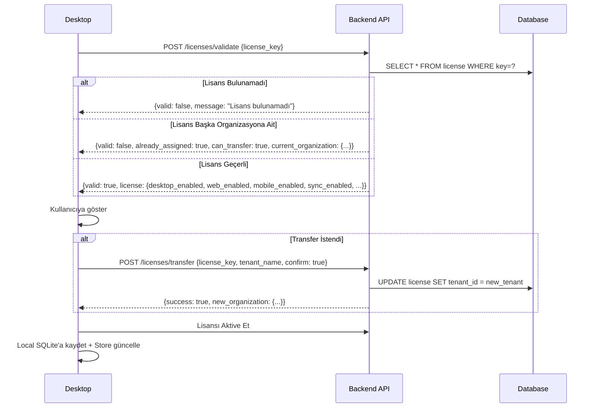

# 🔄 BADER Senkronizasyon Sistemi

## Genel Bakış

BADER, lisans tipine göre farklı senkronizasyon modlarında çalışır:

| Mod | Açıklama | Desktop | Web | Mobil | Sync |
|-----|----------|---------|-----|-------|------|
| **LOCAL** | Sadece offline çalışır | ✅ | ❌ | ❌ | ❌ |
| **ONLINE** | Sadece bulut çalışır | ❌ | ✅ | ✅ | ✅ |
| **HYBRID** | Tüm platformlar + senkronizasyon | ✅ | ✅ | ✅ | ✅ |

---

## 🏗️ Mimari

```
┌─────────────────┐     ┌─────────────────┐     ┌─────────────────┐
│  Desktop App    │     │   Web App       │     │  Mobile App     │
│  (Tauri+React)  │     │   (React)       │     │  (React Native) │
└────────┬────────┘     └────────┬────────┘     └────────┬────────┘
         │                       │                       │
         │    ┌──────────────────┼───────────────────────┤
         │    │                  │                       │
         v    v                  v                       v
    ┌─────────────────────────────────────────────────────────┐
    │                   Backend API (FastAPI)                  │
    │              http://157.90.154.48:8000                   │
    ├──────────────────────────────────────────────────────────┤
    │  /api/v1/auth/*        - Kimlik doğrulama + Lisans       │
    │  /api/v1/licenses/*    - Lisans yönetimi                 │
    │  /api/v1/sync/*        - Veri senkronizasyonu            │
    │  /api/v1/tenants/*     - Organizasyon yönetimi           │
    └──────────────────────────────────────────────────────────┘
                              │
                              v
                    ┌─────────────────┐
                    │   SQLite DB     │
                    │  (Backend)      │
                    └─────────────────┘
```

---

## 📋 API Endpoints

### 1. Lisans API (`/api/v1/licenses/`)

| Endpoint | Method | Açıklama |
|----------|--------|----------|
| `/validate` | POST | Lisans anahtarı doğrula |
| `/activate` | POST | Lisansı aktive et |
| `/transfer` | POST | Lisansı başka organizasyona transfer et |
| `/list` | GET | Tüm lisansları listele (Admin) |
| `/create` | POST | Yeni lisans oluştur (SuperAdmin) |

### 2. Kimlik Doğrulama (`/api/v1/auth/`)

| Endpoint | Method | Açıklama |
|----------|--------|----------|
| `/login` | POST | Giriş yap, platform kontrolü yapar |
| `/me` | GET | Mevcut kullanıcı bilgileri |
| `/refresh` | POST | Token yenile |

**Platform Kontrolü:** Login sırasında `X-Platform` header'ı ile platform bildirimi yapılır. Lisansa göre erişim kontrol edilir.

### 3. Senkronizasyon (`/api/v1/sync/`)

| Endpoint | Method | Açıklama |
|----------|--------|----------|
| `/push` | POST | Desktop → Backend veri gönder |
| `/pull/{tenant_id}` | GET | Backend → Desktop veri çek |
| `/uye` | POST | Tek üye senkronize et |
| `/gelir` | POST | Tek gelir senkronize et |
| `/gider` | POST | Tek gider senkronize et |
| `/kasa` | POST | Tek kasa senkronize et |

---

## 🔐 Lisans Doğrulama Akışı



---

## 📱 Desktop Senkronizasyon Akışı

### SyncService Yapısı

```typescript
// desktop/src/services/syncService.ts

class SyncService {
    private licenseMode: 'local' | 'hybrid' | 'online' = 'local';
    
    shouldSync(): boolean {
        return this.licenseMode !== 'local' && this.isOnline && !!this.token;
    }
    
    async queueChange(tenantId, tableName, action, data) {
        // 1. Local DB'ye kaydet
        // 2. Eğer HYBRID modda ve online ise, sunucuya gönder
    }
}
```

### Senkronize Edilen Tablolar

| Tablo | Desktop → Backend | Backend → Desktop |
|-------|-------------------|-------------------|
| `uyeler` | ✅ | ✅ |
| `gelirler` | ✅ | ✅ |
| `giderler` | ✅ | ✅ |
| `kasalar` | ✅ | ✅ |
| `aidatlar` | ✅ | ✅ |
| `etkinlikler` | ✅ | ✅ |

---

## 🔄 Çalışma Modları

### LOCAL Mod
- Sadece Desktop çalışır
- Veri sadece local SQLite'da tutulur
- Internet bağlantısı gerekmez
- Sync **yapılmaz**

### HYBRID Mod
- Tüm platformlar aktif (Desktop + Web + Mobil)
- Veri hem local hem bulutta tutulur
- Otomatik senkronizasyon
- Çakışma çözümü: "Son yazılan kazanır" (updated_at)

### ONLINE Mod
- Sadece Web ve Mobil çalışır
- Veri sadece bulutta tutulur
- Desktop erişimi **kapalı**

---

## 🛡️ Platform Erişim Kontrolü

Login sırasında backend, lisansa göre platform erişimi kontrol eder:

```python
# backend/app/api/auth.py

if platform == "web" and not license_obj.web_enabled:
    raise HTTPException(403, "Web erişimi lisansınızda yok")

if platform == "desktop" and not license_obj.desktop_enabled:
    raise HTTPException(403, "Desktop erişimi lisansınızda yok")

if platform == "mobile" and not license_obj.mobile_enabled:
    raise HTTPException(403, "Mobil erişimi lisansınızda yok")
```

---

## 📊 Store Yapısı

### LicenseStore (Zustand)

```typescript
interface License {
    id: string;
    key: string;
    plan: 'LOCAL' | 'ONLINE' | 'HYBRID';
    desktop_enabled: boolean;
    web_enabled: boolean;
    mobile_enabled: boolean;
    sync_enabled: boolean;
    expires_at: string;
    features: {
        modules: { ... };
        limits: { max_users, max_members, ... };
        exports: { pdf, excel, api };
    };
}
```

### SyncStore (Zustand)

```typescript
interface SyncState {
    isSyncing: boolean;
    lastSyncAt: string | null;
    pendingChanges: number;
    syncErrors: string[];
    
    triggerManualSync(tenantId, apiUrl, authToken);
    loadSyncStatus(tenantId);
}
```

---

## 🧪 Test Senaryoları

### 1. Lisans Doğrulama
```bash
curl -X POST http://157.90.154.48:8000/api/v1/licenses/validate \
  -H "Content-Type: application/json" \
  -d '{"license_key": "BADER-89CF-6346-8826-A60D"}'
```

### 2. Veri Push (Sync)
```bash
curl -X POST http://157.90.154.48:8000/api/v1/sync/push \
  -H "Content-Type: application/json" \
  -H "Authorization: Bearer <TOKEN>" \
  -d '{
    "tenant_id": "xxx",
    "uyeler": [...],
    "gelirler": [...],
    "kasalar": [...]
  }'
```

### 3. Veri Pull (Sync)
```bash
curl http://157.90.154.48:8000/api/v1/sync/pull/TENANT_ID?since=2026-01-01 \
  -H "Authorization: Bearer <TOKEN>"
```

---

## ⚠️ Bilinen Sorunlar ve Çözümler

| Sorun | Çözüm |
|-------|-------|
| CORS Hatası | Backend `allow_origins=["*"]` ayarlı, 500 hataları CORS gibi görünür |
| Lisans zaten atanmış | `/licenses/transfer` endpoint'i ile transfer edilebilir |
| Offline değişiklikler | `sync_changes` tablosuna kaydedilir, online olunca gönderilir |

---

## 📁 Dosya Yapısı

```
backend/
├── app/api/
│   ├── auth.py          # Kimlik doğrulama + platform kontrolü
│   ├── licenses.py      # Lisans CRUD + validate + transfer
│   ├── sync.py          # Push/Pull senkronizasyon
│   └── tenants.py       # Organizasyon yönetimi

desktop/src/
├── pages/ayarlar/
│   └── lisans.tsx       # Lisans yönetim sayfası
├── services/
│   └── syncService.ts   # Senkronizasyon servisi
├── store/
│   ├── licenseStore.ts  # Lisans state yönetimi
│   └── syncStore.ts     # Sync state yönetimi
└── hooks/
    └── useSync.ts       # Sync hook'ları
```

---

## 🚀 Sonraki Adımlar

1. [ ] Çakışma çözümü (conflict resolution) geliştir
2. [ ] Offline-first mimari güçlendir
3. [ ] Background sync worker ekle
4. [ ] Push notification ile sync bildirimleri
5. [ ] Sync history/audit log
